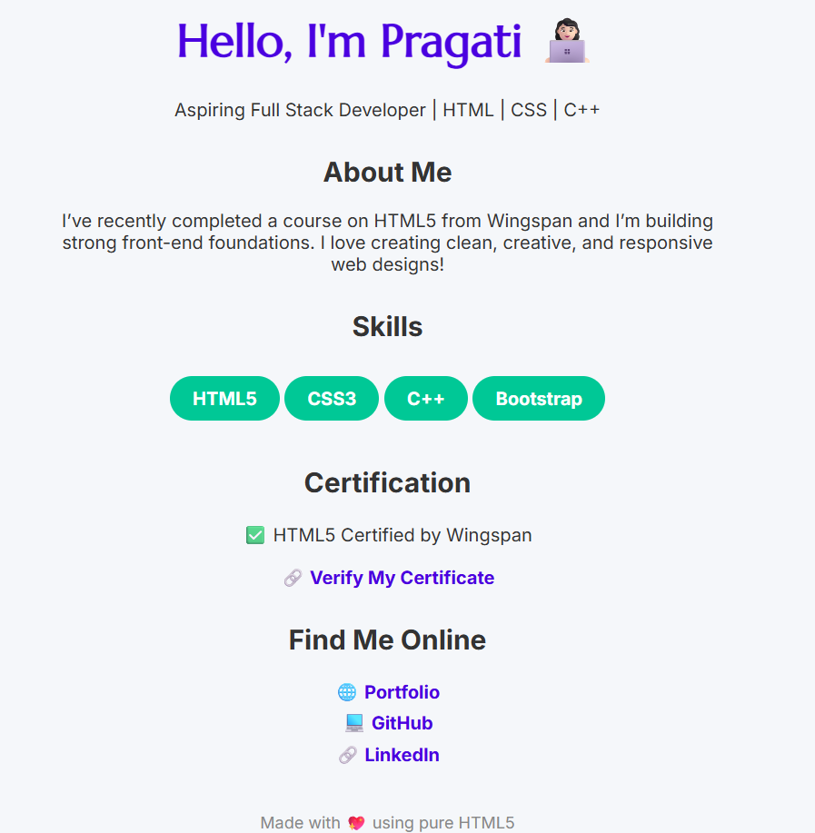

# html5-digital-card
Digital visiting card created using pure HTML5 after completing certification from Wingspan. Hosted on GitHub Pages.
# 🌐 HTML5 Digital Visiting Card

This is a personal digital visiting card built using only **pure HTML5**.  
I created this project after completing my **HTML5 certification from Wingspan** to showcase my basic front-end skills.

## 📌 Features
- One-page responsive design
- Clean semantic HTML structure
- Includes:
  - Personal intro
  - Skills badges
  - Certification badge
  - Portfolio & social links
- Hosted via **GitHub Pages**

## 🚀 Live Preview
🔗 [View Project Live](https://pragati-1111.github.io/html5-digital-card/)

## 🛠️ Technologies Used
- HTML5
- GitHub Pages

## 🏆 Certification
**HTML5 – The Language**  
🗓️ Issued by Wingspan on May 21, 2025  
🔗 [Verify Certificate](https://verify.onwingspan.com/)

## 📷 Screenshot

## 👩🏻‍💻 Author
**Pragati Ahir**  
- 💼 [LinkedIn](https://www.linkedin.com/in/pragati-makwana-a401a6313/)  
- 🌐 [Portfolio](https://pragati-1111.github.io/pragati--portfolio.github.io/)
